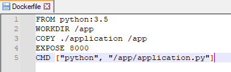

# What exactly is Kubernetes?

Kubernetes is the container orchestration tool of our choice at Nordlys. If you have never worked with Kubernetes, please follow these simple steps listed below to get started.

# Getting started

Let us say we need to run our ExampleApp on the 8000 port in a container within the Kubernetes cluster.

1. Install [Docker](https://docs.docker.com/desktop/) for your OS.
1. Create new directories via the command line:

   > Please remember that unlike on Windows, Linux commands and their options are case sensitive

   ```
   mkdir quickstart_docker
   mkdir quickstart_docker/application
   mkdir quickstart_docker/docker
   mkdir quickstart_docker/docker/application
   ```

   where

   ```
   quickstart_docker/ # is the root directory for the project
   ├──application/    # is the main directory for the app's code
   └──docker/         # is the directory for adjacent Docker purposes
      └──application/ # is the Dockerfile directory for the app
   ```

1. Put the example file for the application `application.py` into the `quickstart_docker/application` directory and set the standard http server parameters:
   
   ```
   import http.server
   import socketserver

   PORT = 8000
   Handler = http.server.SimpleHTTPRequestHandler
   httpd = socketserver.TCPServer(("", PORT), Handler)
   print("serving at port", PORT)
   httpd.serve_forever()
   ``` 

1. Set the environment for the application. Since the example application in Python-based, you are going to need at least Python and an OS with all the respective dependencies. You can find it all on [DockerHub](https://hub.docker.com/) by using the pre-existing image.

   Create a text file named `Dockerfile` into the `quickstart_docker/docker/application` directory and put the following commands into it:

   a. Use base Python image from the registry:

   ```
   FROM python:3.5
   ```
   
   b. Set the work directory to `/app`:
   
   ```
   WORKDIR /app
   ```

   c. Copy the `application` directory contents into the container at `/app`:
   
   ```
   COPY ./application /app
   ```
   
   d. Make port 8000 available to the world outside this container:

   ```
   EXPOSE 8000
   ```
   
   e. Execute `python /app/application.py` when the container launches:
   
   ```
   CMD ["python", "/app/application.py"]
   ```

   The file contents should look like this:

   

   This file will be used as an instruction for the Docker image creation.

1. Run the following script in the terminal:

   ```
   docker build . -f -docker/application/Dockerfile -t exampleapp
   ```

   where: 

   * `.` is your work directory
   * `-f` docker/application/Dockerfile is the Dockerfile
   * `-t exampleapp` is a tag that should make the image easier to find

   ```
   $ docker images
   ```

   The result should look like this:

    ```
    REPOSITORY      TAG         IMAGE ID           CREATED  SIZE 
    exampleapp      latest      83wse0edc28a       2 seconds ago 153MB
    python          3.6         05sob8636w3f       6 weeks ago  153MB
    ```

> Please see the second part of the guide to proceed.
